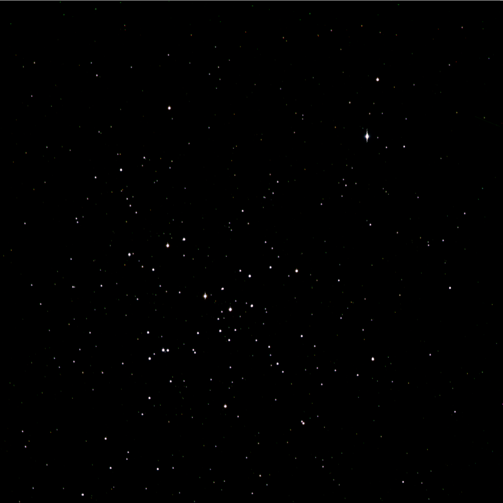
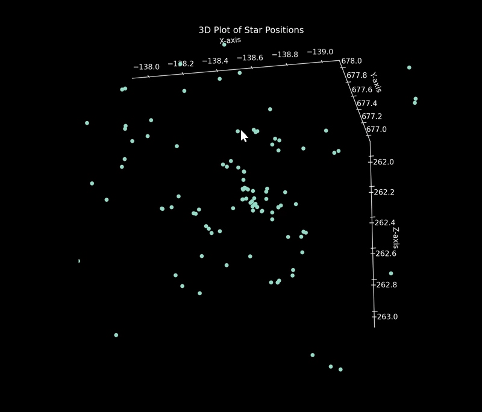

This is my repository to store all the code and data I have been working with for my ASTR 230 Astronomy Lab Final Project. 

The objective of this project is to perform several layers of structural and topological analysis on M41 'Little Beehive Cluster' to determine if there is a relationship between Stellar characteristics and radial distance to the cluster center. My hypothesis is that denser / hotter / bluer stars will exist more frequently and in higher density near the cluster center.

To test my theory, I am using both self-collected data from McDonald Observatory's .8m PFI telescope in Fort Davis, TX and parallax data from Gaia DR3. 

There is some code in here that may be useful to others who want to be able to quickly search for fits files or do fast data reduction / alignment.

<h1>Code in this repository:</h1>

- get_files.py
  -  This does filtered searches through folders for FITS files with the specified exposure times and/or band filters.
- reduce_image.py
  -  This does the whole bias/dark/flat processing thing and the image cropping, all you feed it is the folders with the files and the settings you want turned on or off.
- data_reduction_loop.py
  -  This just loops over all the different exposure times and bands that i captured to group all the images I have of the same type into properly labeled reduced images. Uses both of the files above.
- image_alignment.py
  -  This is actually the stupidest solution imaginable to this problem but i got tired of manually aligning stars so this thing just finds the brightest pixel in every image and
automatically aligns them so that pixel is always in the same spot. Stupid but it works for my data pretty well! Probably would get messed up if you had cosmic rays or detector artifacts brighter than your science data
- star_positions.py
  -  This just uses DAOStarFinder to find all the stars based on your input threshold value and returns a numpy array. Might make it more complicated in the future but right now its stupid simple.

<h1>project outline:</h1>

Here's the general game plan of how this project will work!

**Step 1: Reduce the data.** 
This is simple, done it a million times, easy peasy. 
Will end up with 7 separate images (Long/Medium/Short exposures in the B, V, R bands). 

THIS IS DONE!!! 
V band images look a little sus - it might be nice to get some more data so I have more than just 2 images at each setting. 

**Step 2: Identify Star pixel positions in the data.**
Will have a big numpy array with star ID, pixel x-y coords.
- DAOStarFinder is gonna be a big help here.

THIS IS DONE!!
As expected, tinkering with 'threshold' and 'FWHM' gives wildly different results for the number of stars we detect. Need to spend some time tinkering with the configuration.
Maybe worth filtering out stars that don't appear in every image? Or at least every band?

**Step 3: Match Identified Stars to SIMBAD stars, get parallax distance for each.** 
Will have a big numpy array with star name, pixel x-y coords, real world RA/Dec coords, Distance/Parallax(?) columns.
- SIMBAD? Other resources shown in class powerpoint April 10?

THIS IS DONE!!
got some nice 3d plots too.

**Step 4: Aperture Photometry on each star? Try to find a standard star in the image to calibrate for absolute magnitude.**
Will be able to add a 'absolute magnitude' in each band to the end of the column, along with color values for B-V and V-R. 
- Need to refresh on exactly how this process works. Think there was a tutorial in the 'What's in an Image?' module.

**Step 5: HR Diagram fitting. Use the color values to determine the temp of the stars. Use the distance + magnitude to estimate absolute magnitude.**
Will end up with a nice HR diagram of the whole image showing what we're able to see for each star. Should make it easier to identify any non-cluster members in our image.
- Need to understand more on HR diagrams. Study up!

**Step 6: Possible Analysis.**
Plot the data as a 3D Matplotlib scatter. Examine structure!
Make age estimations based on deviation from the HR path?
- HR diagrams are gonna need to be something I understand a lot better to really get this one. 

Maybe there's an interesting relationship between distance to the center and age? estimated mass? Would expect more/brighter stars near center. Is that true?
- Probably gonna want a couple different plots for this one. Take avg distance/RA/Dec position as the center and then calculate radial distance vs some value to get a nice 2D chart.

Can we determine if the cluster is spinning? Why or why not? If so, can we make a guess at how fast? 
- This needs research. Read some papers! Study up!
